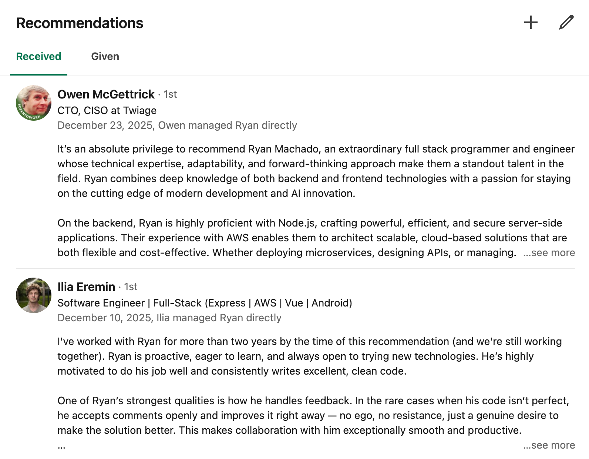

Você não precisa “embelezar” o LinkedIn.

Precisa **ficar encontrável** e **ficar óbvio**.

## 1) Ativar “Open to work” (sem selo verde)

- Perfil → **Open to** → **Finding a job**
- Preenche: cargos, contrato, localidade
- No final: **Apenas recrutadores**


**Por quê:** isso muda o roteamento interno. Você entra no radar sem dizer a todos que está procurando um emprego novo.

## 2) Arrumar a headline (SEO + intenção)

Inclui:

- cargo atual/desejado
- **5 palavras-chave** que recrutador busca

Exemplos:

- `Backend Engineer | Node.js, TypeScript, PostgreSQL, AWS, CQRS`
- `Mobile Engineer | Android, Kotlin, Jetpack Compose, CI/CD, BLE`
- `Fullstack | React, Node.js, Prisma, Postgres, AWS`

Essa headline tem que funcionar como query.

## 3) Reescrever About + Top Skills

### About (modelo)

1. **Quem você é + foco**
2. **2–4 impactos** (número, tempo, escala)
3. **stacks**
4. **o que você quer** (alvo claro)

Exemplo de bloco (edita pra tua realidade):

- `Atuo com sistemas distribuídos e automação de pipelines.`
- `Stack: Node/Bun, TypeScript, AWS, Mongo/DocumentDB, Redis, filas.`
- `Busco backend/distributed systems com impacto real em produto.`

### Top 5 skills

Repetir as techs que você quer que “colem” no teu nome.

## 4) Adicionar seções relevantes (sem encher linguiça)

Add profile section:

- Projetos (com link)
- Certificações / cursos (se reforçam o alvo)
- Publicações / prêmios / voluntariado (se contam história)

Regra: **se não ajuda na vaga alvo, não entra.**

## 5) Melhorar descrições de experiência (bullets, não redação)

Troca texto por bullets usando:

- **XYZ**: `Fiz X, medido por Y, usando Z`
- **STAR**: Situação → Tarefa → Ação → Resultado

E sempre:

- stack explícita
- escopo (users/requests/dados)
- impacto (tempo, custo, bugs, receita, SLA)

## 6) Copiar dos melhores (busca booleana)

Você não precisa inventar formato. Você precisa roubar estrutura.

Exemplo:

```txt
site:linkedin.com/in ("Python" AND "Django" AND "Sao Paulo" AND (developer OR engineer OR backend))
```

Abra os melhores e copie:

- headline
- primeiras linhas do about
- como escrevem bullets
- como mostram impacto

## 7) Ciclo de revisão contínua

pede feedback/recomendaçao pra 1–2 pessoas da área



ajusta stack conforme foco muda

Se você fizer só isso, seu LinkedIn já sai de “cartão de visita morto” pra “funil”.
